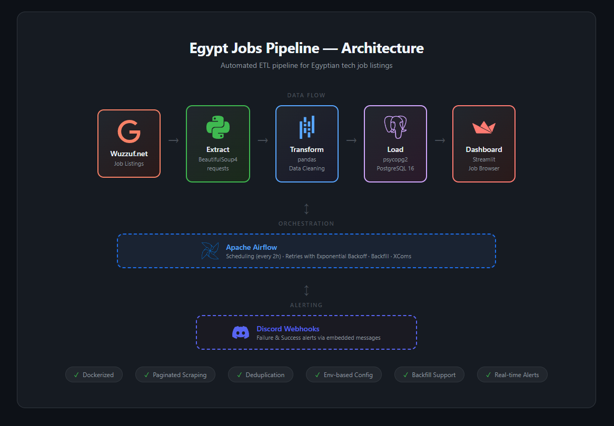
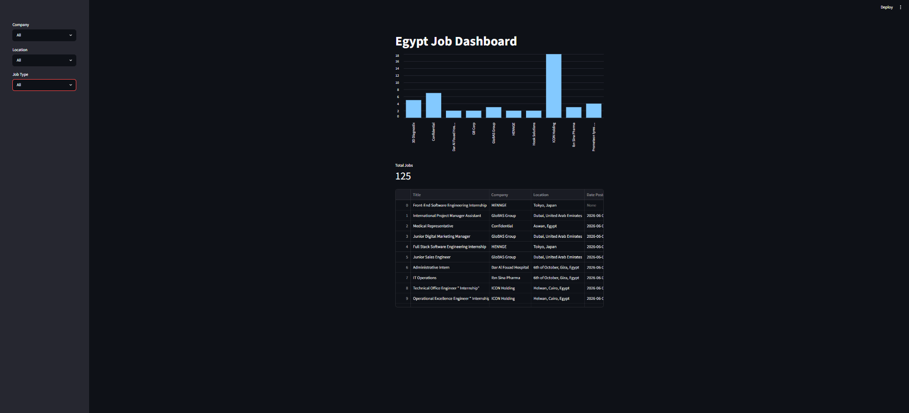
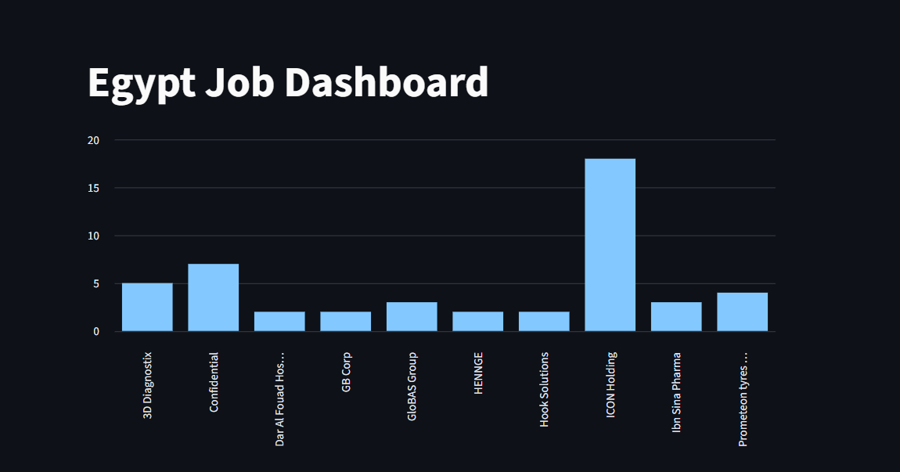
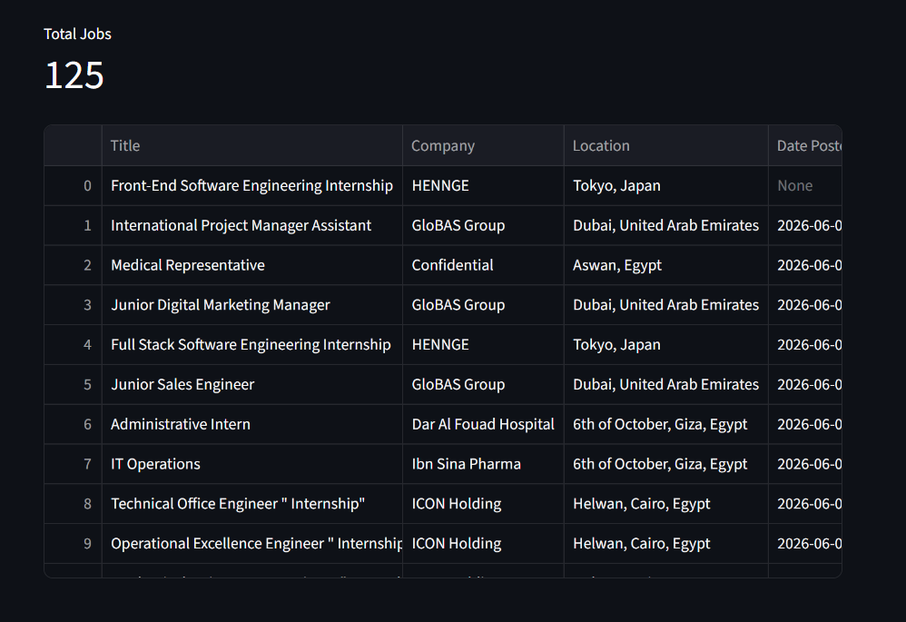

# Egypt Jobs Pipeline

> A data pipeline that scrapes Egyptian tech job listings from [Wuzzuf.net](https://wuzzuf.net), stores them in Postgres, and prepares them for analysis. Built as a portfolio project to learn data engineering fundamentals.


---

## Overview

This pipeline automates the collection of Python job listings in Egypt and the MENA region. It pulls structured job data straight from Wuzzuf's search results, cleans it, and loads it into a local Postgres database — ready for analysis or downstream tools.

## Architecture



## Features

- Paginated scraping (handles all pages dynamically, not just the first one)
- Defensive parsing — won't crash on missing fields
- Deduplicates on job URL
- Postgres runs in Docker — no local install needed
- Credentials stored in `.env`, never committed
- Automated scheduling via Apache Airflow (every 2 hours)
- Retry logic with exponential backoff (3 retries)
- Discord webhook alerts on task failure and success
- Backfill support for re-running past date intervals
- Streamlit dashboard for browsing and filtering jobs

## Tech Stack

| Layer | Tool |
|-------|------|
| Language | Python 3.13 |
| HTTP | requests |
| Parsing | BeautifulSoup4 |
| Database | PostgreSQL 16 |
| DB Driver | psycopg2 |
| Infra | Docker Compose |
| Config | python-dotenv |
| Orchestration | Apache Airflow 2.10 |
| Dashboard | Streamlit |
| Alerting | Discord Webhooks |

## Project Structure

    egypt-jobs-pipeline/
    ├── dags/
    │   ├── egypt_job_dag.py   # Main ETL DAG
    │   └── hello_dag.py       # Test DAG
    ├── src/
    │   ├── extract/           # Scraper (Wuzzuf)
    │   ├── transform/         # Cleaning logic
    │   ├── load/              # Postgres loader
    │   └── utils/             # Discord alerts
    ├── docs/                  # Architecture diagram
    ├── sql/                   # Table schemas
    ├── tests/                 # Tests
    ├── dashboard.py           # Streamlit job browser
    ├── docker-compose.yml
    ├── requirements.txt
    └── main.py                # V1 entry point

## Getting Started

### 1. Clone the repo

```bash
git clone https://github.com/mohamed-mahmoud-de/Egypt-Job-Pipeline.git
cd Egypt-Job-Pipeline
```

### 2. Create a `.env` file in the project root

```
POSTGRES_USER=pipeline_user
POSTGRES_PASSWORD=pipeline_pass123
POSTGRES_DB=egypt_jobs
DISCORD_WEBHOOK_URL=https://discord.com/api/webhooks/your-webhook-url
```

### 3. Start services

```bash
docker-compose up -d
```

This starts Postgres (port `5433`) and the Airflow stack (webserver, scheduler, metadata DB).

### 4. Create the schema

```bash
type sql\create_tables.sql | docker exec -i egyptjobpipeline-postgres-1 psql -U pipeline_user -d egypt_jobs -p 5432
```

### 5. Set up Python

```bash
python -m venv venv
venv\Scripts\activate
pip install -r requirements.txt
```

### 6. Run the pipeline

```bash
python main.py
```

You should see `Inserted N jobs.` and the data will be available in your Postgres `jobs` table.

### 7. Run with Airflow

```bash
docker-compose up -d
```

Access the Airflow UI at `http://localhost:8080` (admin/admin). Enable the `egypt_job_dag` to start scheduled runs.

### 8. Launch the dashboard

```bash
streamlit run dashboard.py
```

Open `http://localhost:8501` to browse scraped jobs.

## Sample Output

After running, you can query the database directly:

```sql
SELECT company, COUNT(*) AS openings
FROM jobs
GROUP BY company
ORDER BY openings DESC
LIMIT 5;
```
## Dashboard







## Roadmap

- **V1** — Naive Python script, single source, runs on demand *(complete)*
- **V2 (current)** — Airflow DAG with scheduling, retries, exponential backoff, Discord alerting, backfill, and Streamlit dashboard
- **V3** — Streaming pipeline with Kafka + Spark for real-time job ingestion

## Author

**Mohamed Mahmoud** — Data Engineering student & DEPI intern  
Building projects to learn data engineering hands-on.